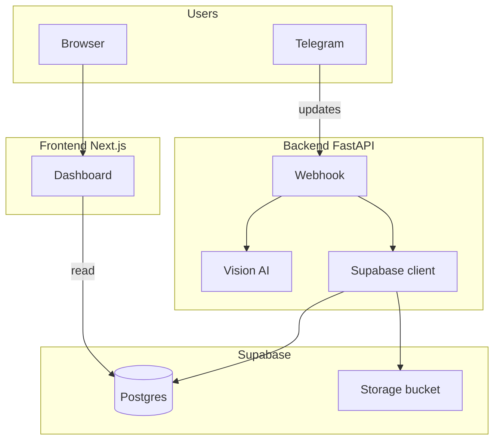

# Animal Photos — Telegram bot & dashboard

[](https://github.com/konat1993/animal-photos-telegram-bot/actions/workflows/ci.yml)

End-to-end flow: observers send a **photo** and **location** via Telegram; a **FastAPI** backend downloads the image, runs **OpenAI Vision** for species identification, reverse-geocodes coordinates for context, and persists reports in **Supabase** (Postgres + Storage). A **Next.js** dashboard shows aggregate stats, a map, filters, and species insights.

---

## Architecture



- **Inbound:** Telegram posts JSON to `POST /telegram/webhook` (HTTPS required in production; use ngrok or similar for local bot testing).
- **Outbound:** Backend uses Telegram Bot API, OpenAI, Nominatim (reverse geocoding), and Supabase service role for storage insert and DB writes.
- **Dashboard:** Next.js uses the Supabase **publishable** key (client-safe) to read `animal_reports`; RLS should allow `SELECT` for anon where appropriate.

---

## Repository layout

| Path | Role |
|------|------|
| [`backend/`](backend/) | FastAPI app (`backend.app.main`), webhook, services (Telegram, Vision, Supabase), tests |
| [`frontend/`](frontend/) | Next.js App Router UI: KPIs, table, map, filters, Playwright E2E |
| [`supabase/migrations/`](supabase/migrations/) | SQL migrations (schema, RLS, optional features) |
| [`deploy/`](deploy/) | Caddy config for production TLS reverse proxy |
| [`docker-compose.yml`](docker-compose.yml) | Caddy + frontend + backend ([`.env.docker.example`](.env.docker.example)) |
| [`docs/deploy-droplet.md`](docs/deploy-droplet.md) | Production deployment on a VPS |

### Monorepo file tree

High-level layout (generated from the repo; omitting `node_modules`, `.next`, `.venv`, and other generated paths):

```text
.
├── .github/workflows/ci.yml       # pytest, Biome, Vitest, build, Playwright
├── docker-compose.yml             # Caddy + frontend + backend
├── .env.docker.example            # Template for Docker / VPS env
├── README.md
├── backend/
│   ├── app/
│   │   ├── main.py                # FastAPI app factory
│   │   ├── api/
│   │   │   └── telegram_webhook.py
│   │   ├── core/
│   │   │   └── config.py          # Pydantic settings / env
│   │   ├── models/
│   │   │   └── schemas.py       # Telegram + domain models
│   │   └── services/
│   │       ├── telegram_client.py
│   │       ├── supabase_client.py
│   │       ├── vision_ai.py
│   │       ├── location_from_text.py
│   │       └── reverse_geocode.py
│   ├── tests/                     # pytest (schemas, geocode, webhook, …)
│   ├── Dockerfile
│   ├── pyproject.toml
│   └── .env.example
├── frontend/
│   ├── app/                       # App Router: page, layout, route components
│   ├── components/ui/             # Shared UI primitives (shadcn-style)
│   ├── lib/                       # Supabase client, dashboard data, demo mode, utils
│   ├── e2e/                       # Playwright specs
│   ├── public/
│   ├── Dockerfile
│   ├── next.config.ts
│   ├── playwright.config.ts
│   ├── vitest.config.ts
│   └── .env.example
├── supabase/migrations/
│   ├── 001_init.sql
│   ├── 002_location_labels.sql
│   └── 003_species_fact.sql
├── deploy/
│   └── Caddyfile
└── docs/
    ├── deploy-droplet.md
    └── …                          # Design notes, SSH, etc.
```

---

## Tech stack

| Layer | Technologies |
|-------|----------------|
| Backend | Python 3.10+, FastAPI, Uvicorn, Pydantic Settings, httpx, OpenAI SDK, Supabase Python client |
| Frontend | Next.js 16, React 19, Tailwind CSS v4, Biome, Supabase JS client, Leaflet |
| Data | Supabase (Postgres, Storage, optional RLS) |
| CI | GitHub Actions: `pytest`, Biome, Vitest, production build, Playwright |

---

## Prerequisites

- **Python** ≥ 3.10 and [**uv**](https://docs.astral.sh/uv/) (backend)
- **Node.js** 20+ and npm (frontend)
- **Supabase** project with migrations applied and `animal-photos` storage bucket where applicable ([`supabase/migrations/`](supabase/migrations/))
- **Telegram** bot token ([BotFather](https://core.telegram.org/bots#6-botfather))
- **OpenAI** API key (Vision + chat for location parsing fallback)

For UI-only local work you can enable **demo mode** (no Supabase or backend required).

---

## Environment variables

### Backend — `backend/.env`

Copy from [`backend/.env.example`](backend/.env.example). Names are **uppercase**; `pydantic-settings` loads `backend/.env` when the process working directory is `backend/`.

| Variable | Required | Purpose |
|----------|----------|---------|
| `TELEGRAM_BOT_TOKEN` | Yes | Telegram Bot API token |
| `SUPABASE_URL` | Yes | Project URL |
| `SUPABASE_SECRET_KEY` | Yes* | Service role / secret key for server-side Storage + DB |
| `SUPABASE_SERVICE_ROLE_KEY` | No | Legacy alias for the same key if `SUPABASE_SECRET_KEY` is unset |
| `OPENAI_API_KEY` | Yes | OpenAI API key |
| `OPENAI_MODEL` | No | Default `gpt-4o` |
| `PUBLIC_DASHBOARD_URL` | Yes | Public URL of the dashboard (shown in bot copy) |
| `GEOCODING_USER_AGENT` | No | Custom User-Agent for Nominatim (defaults in [`config.py`](backend/app/core/config.py)) |

\*One of `SUPABASE_SECRET_KEY` or `SUPABASE_SERVICE_ROLE_KEY` must be set.

### Frontend — `frontend/.env.local` (or `.env`)

Copy from [`frontend/.env.example`](frontend/.env.example). `NEXT_PUBLIC_*` variables are embedded at **build time**.

| Variable | Required | Purpose |
|----------|----------|---------|
| `NEXT_PUBLIC_SUPABASE_URL` | Yes* | Supabase project URL |
| `NEXT_PUBLIC_SUPABASE_PUBLISHABLE_KEY` | Yes* | Publishable / anon client key for browser reads |
| `NEXT_PUBLIC_SUPABASE_ANON_KEY` | No | Legacy alias if publishable key is unset |
| `NEXT_PUBLIC_DEMO_MODE` | No | Set to `true` to use built-in sample data (no Supabase calls) |

\*Not required when `NEXT_PUBLIC_DEMO_MODE=true`.

### Docker / VPS

For `docker compose up`, use a single `.env` next to [`docker-compose.yml`](docker-compose.yml). See [`.env.docker.example`](.env.docker.example) for variable names and [docs/deploy-droplet.md](docs/deploy-droplet.md) for rollout steps.

---

## Local development

Run **backend** and **frontend** in separate terminals from the monorepo root.

### 1. Backend API

```bash
cd backend
cp .env.example .env
# Edit .env with real tokens and URLs

uv sync
export PYTHONPATH=..
uv run uvicorn backend.app.main:app --reload --host 0.0.0.0 --port 8000
```

- Imports use the `backend` package; **`PYTHONPATH` must include the repository root** (parent of `backend/`).
- Health check: `GET http://localhost:8000/health`
- Webhook: `POST http://localhost:8000/telegram/webhook` — configure this URL in Telegram only when it is reachable over HTTPS (e.g. ngrok tunnel to port 8000).

### 2. Frontend dashboard

```bash
cd frontend
cp .env.example .env.local
# Set NEXT_PUBLIC_SUPABASE_* for real data, or enable demo mode below

npm install
npm run dev
```

Open [http://localhost:3000](http://localhost:3000).

**Demo mode (no Supabase):** add to `.env.local`:

```bash
NEXT_PUBLIC_DEMO_MODE=true
```

Restart `npm run dev`; the dashboard uses static sample data from [`frontend/lib/demo-data.ts`](frontend/lib/demo-data.ts).

### 3. Quality checks (same as CI locally)

```bash
# Backend
cd backend && uv sync --group dev && uv run pytest

# Frontend
cd frontend && npm run lint && npm run test && npm run build
```

**E2E (Playwright):** requires a production build and Chromium; uses standalone server on port **3001** (see [`frontend/playwright.config.ts`](frontend/playwright.config.ts)).

```bash
cd frontend
NEXT_PUBLIC_DEMO_MODE=true npm run build
npx playwright install chromium
npm run test:e2e
```

---

## Tests

| Suite | Command |
|-------|---------|
| Backend | `cd backend && uv sync --group dev && uv run pytest` |
| Frontend unit | `cd frontend && npm run test` |
| Frontend E2E | `cd frontend` → build with demo mode → `npx playwright install chromium` → `npm run test:e2e` |

---

## Production deployment

- **Docker Compose:** build-time args for Next public env vars; runtime env for the backend — see [`.env.docker.example`](.env.docker.example) and [`docker-compose.yml`](docker-compose.yml).
- **Step-by-step VPS:** [docs/deploy-droplet.md](docs/deploy-droplet.md).

---

## Further reading

- Package-specific entry points are documented in the root sections above. Legacy `backend/README.md` and `frontend/README.md` redirect here.
